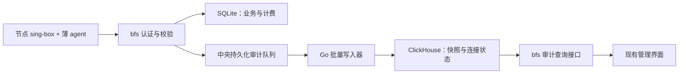

# ClickHouse 网络审计方案与开源参考

整理日期：2026-10-07。状态：研究与实施建议，尚未部署或完成性能验证。

本文把此前“大量网络日志、24GB 中央服务器、按用户追查节点及域名”的需求整理成可实施方案。仓库中没有已有 ClickHouse 设计文档；以下具体表结构、资源预算和迁移步骤是本次建议，不代表已经确认的历史决定。

## 推荐方向

保留 SQLite 管用户、节点、凭据、配置和计费账本；将增长快的结构化连接审计交给 ClickHouse。继续使用 BoxFleet 的节点认证、agent 上报和管理界面，不在边缘节点部署数据库或 Docker。

第一阶段：bero 上单机 ClickHouse，中央 Go 批量写入器加持久化待发送队列。Kafka 留到实测证明需要多消费者、独立重放或横向扩展时再引入。Akvorado 借鉴其流量分析架构与界面，而非直接替换 BoxFleet 的采集链路。



这是目标架构；当前没有上述 ClickHouse 写入与读取实现。

## 先明确可以回答什么

| 问题 | 数据依据 | 限制 |
| --- | --- | --- |
| 某用户在某天用了多少计费流量，经过哪些节点？ | v2ray 流量计数及现有账本 | 保持现有计费口径 |
| 这些连接访问哪些域名，各有多少连接和观察到的字节？ | opt-in connection stream | 是审计估算，显示归属率、重连和丢失指标 |
| 旧 journal 日志中的域名用了多少字节？ | 不具备所需字段 | 不能把无域名的流量账本与无字节的日志拼接成真实归因 |
| 10 月 7 日某用户的大流量是否来自 Hugging Face？ | 同时间、用户、节点的连接证据 | 域名猜测不能替代查询结果；本文没有验证该事件 |

代理传输了 200GB，不意味着产生了 200GB 审计数据。容量需要测量报告数、每报告行数、累计快照更新次数、平均行大小和压缩后磁盘占用。

现有实现依据：[`connection_telemetry.go`](../internal/model/connection_telemetry.go)、[`connection_events.sql`](../queries/connection_events.sql)、[采集说明](connection-telemetry.md)、[ADR 0002](adr/0002-opt-in-connection-telemetry.md)。连接审计不替代计费；数据库变快也不能消除上游连接流的丢失。

## Akvorado：值得借鉴的部分

[Akvorado 简介](https://akvorado.net/docs/intro)和[源码](https://github.com/akvorado/akvorado)描述了四个组件：inlet 接收 NetFlow/IPFIX/sFlow 并送 Kafka；outlet 解码、补充元数据后写 ClickHouse；orchestrator 管配置及存储结构；console 提供分析界面。

值得借鉴：采集与查询解耦；明细与降采样表分开；按维度筛选并下钻；用接口、网络边界等元数据解释流量；明确采样与重复计数的影响。BoxFleet 对应的维度应是用户、节点、域名、出站和链路，而非照搬路由器接口维度。

NetFlow/IPFIX/sFlow 是网络设备流记录，不能直接提供 BoxFleet 的代理认证用户及应用层目标域名。保留 sing-box 的结构化上报；未来需要路由器视角时，可将其作为独立来源，避免与代理数据相加。

[运维文档](https://demo.akvorado.net/docs/operations)给完整部署的最低配置为 16GB RAM、50GB 磁盘、8 vCPU，推荐内存 32GB 以上。这是 Akvorado 整套服务的要求，不能当成单独 ClickHouse 的最低要求。24GB 服务器同时运行 BoxFleet 和开发构建时，不宜未经测量直接搬入完整栈。

## 数据模型与正确性

### 三类数据分别保存

1. **报告及覆盖信息**：认证后的 node_id、agent_boot_id、sequence、报告窗口、接收时间、归属和丢失指标。
2. **连接累计快照**：connection_id、started_at、观察窗口、用户 ID、认证名、源 IP、目标 host/port、协议、出站、链路、累计上下行字节、关闭状态。
3. **旧版聚合记录**：无 connection_id 的维度桶及 journal 连接记录，带明确 source/schema_version。不能伪造为一条条可追踪会话。

使用不可变资源 ID 保留删除后的历史关系；展示名称另行保留或解析。node_id 必须由服务端认证填入。时间统一 UTC，查询沿用服务端分桶与本地日界线 offset 规则。接收时间用于排查延迟，不作为业务统计时间。

### 两层去重

报告重试身份为 `(node_id, agent_boot_id, sequence)`。连接身份为 `(node_id, connection_id, started_at)`，不含 agent_boot_id，避免 agent 重启把同一连接变成新连接。

现有新格式的字节是**生命周期累计值**：100MB 快照之后是 150MB，最终应为 150MB；旧格式聚合桶才按增量相加。同一连接多次 UPDATE 也不能每次计作一个连接。

第一版先保存快照，并以连接身份合并 `max(uplink_bytes)`、`max(downlink_bytes)`、最早开始时间、最新观察时间及单调关闭状态；其他字段需定义冲突与补全规则。先得到规范连接状态，再做 Top N、过滤和分页，不能先 LIMIT 后去重。对可变字段的过滤也要避免误选旧快照。

[ReplacingMergeTree](https://clickhouse.com/docs/reference/engines/table-engines/mergetree-family/replacingmergetree)的去重依赖完整 ORDER BY，后台合并是最终一致的。因此不能只靠“以后会 merge”保证实时查询正确，也不能把可变字段或快照版本放进连接身份键。若采用该引擎，必须验证 FINAL 或规范化查询的成本；不能假定“最新整行”天然等价于当前 SQLite 的逐字段 MAX 合并。

分区应采用不可变的连接开始月份等候选设计，不能按不断变化的 window_end 把同一连接分到不同分区。排序键、投影及分区粒度需根据用户/节点/时间过滤压测决定，本文不提供未经验证的生产 DDL。

### 聚合最大的陷阱

[增量物化视图](https://clickhouse.com/docs/concepts/features/materialized-views/incremental-materialized-view)处理新插入的数据块，不会因为源表后来去重而自动撤回旧累计值。把 100MB、150MB 两次快照直接 SUM，会得到错误的 250MB。

建议先验证原始快照 → 规范连接状态的正确性，再选择：

- 使用可合并的最大值状态维护每连接累计值，查询时再汇总。
- 对有边界的窗口定期重算汇总；可参考[刷新物化视图](https://clickhouse.com/docs/concepts/features/materialized-views/refreshable-materialized-view)，明确刷新延迟与扫描成本。
- 如确实需要流量发生时间上的分钟/小时曲线，新增可重试的区间增量协议与持久化状态，单独设计和测试。

“某小时关闭的连接总字节”或“某天开始的连接生命周期字节”都不是该小时/该天实际传输的字节。跨日长连接必须在界面标清口径。现有快照不能自动提供精确的时间区间流量；差分也只能提供观察区间估计，并需处理迟到、重启与缺口。

域名服务分类继续支持查询时覆盖规则；若预聚合了服务分类，需记录分类版本并提供重算机制。journal 与 stream 的切换区间沿用现有规则，避免同一连接被两个来源重复统计。

## 高性能写入与故障恢复

[ClickHouse 写入建议](https://clickhouse.com/docs/concepts/best-practices/selecting-an-insert-strategy)强调批量写入，减少小 part 和合并压力。BoxFleet 初始可采用中央批量 1,000–10,000 行或 1–5 秒刷新，以先达到者为准；这些是待压测参数，低负载时允许更小批次。

建议在中央维护有容量上限的持久化队列，记录批次 ID、校验和与消费进度。服务端只有在达到约定持久化边界后才确认接收；队列满时按既有 agent 重试能力返回可重试失败，并验证 agent 是否真正保留待重试报告。不能成功响应后丢弃数据。

写入成功后再推进消费位置；必须测试“ClickHouse 已提交、队列尚未确认就崩溃”的重放。连接快照重复可用逻辑 MAX 合并控制，但旧版增量桶与 coverage 同样需要幂等，不能只修新格式。

[重试去重文档](https://clickhouse.com/docs/guides/developer/deduplicating-inserts-on-retries)提供插入去重机制，但窗口有界、引擎及异步写入行为与版本相关。试点固定版本，验证目标引擎配置；同一批次重试保持内容、顺序和 token，不同批次不能复用 token。它不构成无限期 exactly-once 保证。

可以参考 [Vector ClickHouse sink](https://vector.dev/docs/reference/configuration/sinks/clickhouse/)的批量、压缩、磁盘缓冲和背压设计。Vector 不能替我们解决累计快照统计语义；磁盘缓冲也不等于每条 HTTP ACK 都已经 fsync，接入前需验证端到端持久化承诺。

ClickHouse 仅在内部网络访问。审计故障应有队列积压、最旧报告年龄、写入失败、丢失与容量告警；计费和管理操作保持独立可用。单机持久化不等于高可用，仍需备份和恢复演练。

## 24GB bero 的试点预算

以下是资源约束的起点，不是实测需求：ClickHouse 约 10GB、bfs 约 3GB、系统及文件缓存约 6GB，保留约 5GB 弹性。实际需测量峰值再调整；ClickHouse 内部查询与后台任务限制应低于容器内存上限，不能只设置 Docker 上限后等待 OOM。

开发编译与审计查询共享 CPU、内存和磁盘，需限制构建并发，并测试构建时的线上延迟。初始单机使用本地 SSD 持久卷，不增加 Kafka/ZooKeeper。高基数字段（IP、完整域名、连接 ID）与低基数字段分别选择类型和索引策略，不能盲目为所有字段做字典或索引。

容量估算：

```
每日存储 ≈ 每日报告中的快照行数 × 实测压缩后每行字节
所需磁盘 ≈ 明细保留占用 + 汇总占用 + 队列 + 合并余量 + 备份需求
```

取真实数据测量压缩效果；长连接频繁更新会提高快照数。可试验 30–90 天明细、较长周期小时/日汇总，但最终 TTL 应结合当前保留设置与用户需求确定。长期活跃连接的清理依据需考虑最新观察时间，不能因开始时间太早而提前删掉。

## 更多开源参考

下表“适用判断”为对 BoxFleet 的工程判断，不是已完成的性能对比。

| 项目 | 官方定位与参考点 | 对 BoxFleet 的适用判断 |
| --- | --- | --- |
| [Akvorado](https://github.com/akvorado/akvorado) | 网络流采集、Kafka、ClickHouse、分析界面 | 最贴近网络流分析，借鉴架构及下钻；采集协议不同 |
| [ClickStack / HyperDX](https://github.com/hyperdxio/hyperdx) | ClickHouse 上的可观测性检索界面，可连接已有表；一体部署还包含 collector、MongoDB 等 | 借鉴检索、保存查询、详情交互；作为独立探索界面评估，不必替换管理 UI |
| [Vector](https://vector.dev/docs/reference/configuration/sinks/clickhouse/) | 可配置批量、缓冲和重试的采集管道 | 参考可靠写入与背压；不是数据库或会话归并器 |
| [GoFlow2](https://github.com/netsampler/goflow2) | Go 实现的 NetFlow/IPFIX/sFlow collector，支持 JSON/Protobuf 输出 | 将来补充设备流视角；仍需独立存储、归属与界面 |
| [VictoriaLogs](https://docs.victoriametrics.com/victorialogs/) | 日志存储与 LogsQL；[高基数字段不应作为 stream fields](https://docs.victoriametrics.com/victorialogs/keyconcepts/) | 运维简单的日志方案候选，需用真实连接聚合查询对比 ClickHouse |
| [OpenObserve](https://github.com/openobserve/openobserve) | Rust、单二进制、SQL 查询、Parquet/S3 设计的观测平台 | 希望直接获得日志平台和界面时评估；核对所需功能的开源版边界 |
| [Quickwit](https://quickwit.io/docs/overview/architecture) | 倒排索引、对象存储 split，可区分索引和搜索职责 | 全文搜索和冷历史检索优先时值得评估；多维字节聚合需实测 |
| [Grafana Loki](https://grafana.com/docs/loki/latest/get-started/labels/cardinality/) | 标签组织日志，避免高基数标签 | 适合 system logs；用户、IP、域名不应全做 label，审计分析优先试 ClickHouse |
| [Zeek](https://docs.zeek.org/en/current/reference/logs/conn.html) | 网络传感器，conn 日志包含连接与字节等元数据 | 借鉴字段与观测质量标记；是采集来源，不能自动恢复代理认证用户 |
| [ntopng](https://www.ntop.org/guides/ntopng/flow_dump/clickhouse/index.html) | 网络流分析，支持 ClickHouse flow dump | 借鉴流详情；该 ClickHouse 功能要求 Enterprise M 或更高，不能当作完整免费方案 |
| [FastNetMon](https://github.com/pavel-odintsov/fastnetmon) | 基于流记录/镜像等来源的 DDoS 检测 | 参考速率异常和告警思路，目标与用户域名历史审计不同 |

建议优先深入 Akvorado、ClickStack、Vector；替代存储 PoC 选 VictoriaLogs 或 OpenObserve 中一个即可，避免同时铺开过多组件。供应商公布的压缩或速度倍数没有用于本文容量结论。

## 实施顺序与验收

1. **量化现状**：至少采样一天的报告数、会话数、更新次数、行大小、查询延迟及 coverage；记录代理传输量与日志写入量两个不同指标。
2. **离线 PoC**：脱敏真实样本加 10 万、100 万、1,000 万行规模；测试 24 小时、7 天、90 天筛选、用户/节点/域名 Top N、详情和小时图。
3. **正确性用例**：同报告重试、乱序累计快照、agent 重启、sing-box 重启、缺 NEW 的 CLOSED、跨日连接、旧增量桶、删除用户、双来源切换、故障重放；结果对照现有 SQLite 口径。
4. **影子写入**：先少量节点，读取仍用原库；限定资源，测试 ClickHouse 停机、队列满、恢复与备份还原。之后扩展全量。
5. **查询切换**：在现有 facade 边界提供审计存储接口，分页、序列、分类和筛选共享同一规则；明确数据延迟与口径。保留可回退读取路径。
6. **历史迁移**：区分 journal、旧聚合与连接状态；按水位回填并核对数量/字节。只有确认新库及备份可恢复后，再按保留政策清理旧审计数据。业务和计费记录不迁出 SQLite。

性能验收需同时记录 P50/P95、扫描行数、CPU/内存、磁盘、parts/合并积压、写入及查询延迟；还要在开发构建并行时重复关键负载。可以先以常用查询 P95 1 秒作为试点目标，但这不是已验证的承诺。故障恢复后无重复计数、无静默丢弃，与查询速度同等重要。

本阶段交付研究文档，不修改采集协议、数据库迁移或线上配置，也不运行浏览器端到端检查。
